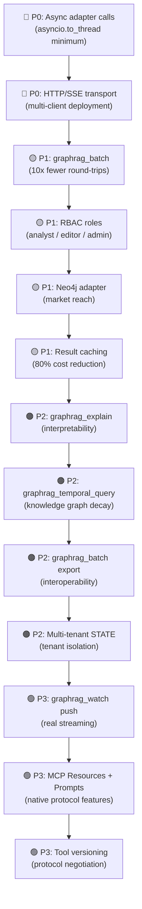

# 🔥 GraphRAG MCP Server — Brutal Audit & God-Tier Upgrade Roadmap

> Reviewed: [`mcp_server/mcp_server.py`](file:///home/ansh/graphrag-protocol/mcp_server/mcp_server.py) · 613 lines, 27 tools, 10 contracts
> Date: September 2026

---

## 📊 Current Score: 6.8 / 10

| Category | Score | Notes |
|---|---|---|
| **Tool Coverage** | 7/10 | 27 tools is solid, but gaps are glaring |
| **Architecture** | 8/10 | Contract layering is clean and principled |
| **Auth / Security** | 4/10 | Admin token only — no RBAC, no per-tool scoping |
| **Transport** | 5/10 | stdio only — zero HTTP/SSE transport exposure via MCP itself |
| **Observability** | 4/10 | No structured logging, no tracing, no metrics endpoint |
| **Multi-Backend** | 5/10 | Only TigerGraph + demo adapter, federation is half-baked |
| **Async** | 3/10 | Everything is sync inside async MCP shell — blocking I/O |
| **Error DX** | 6/10 | Errors returned as JSON strings, not MCP error types |
| **Test Coverage** | 5/10 | Only 7 test cases, no contract-level property tests |
| **Config / Dev UX** | 6/10 | .mcp.json minimal, no multi-profile support |

---

## 🩸 Brutal Ratings Section

### What's Actually Good
- ✅ Contract layering (retrieval → schema → provenance → federation → evaluation) is a genuinely good architecture
- ✅ Lazy adapter init — server never crashes on import
- ✅ `classify_query()` heuristic auto-routing is a clever UX touch
- ✅ Provenance tracking on every result is production-grade
- ✅ RRF + weighted-score merge strategies in federation
- ✅ Thread-safe `StreamBus` with bounded queues
- ✅ Constant-time token comparison in auth (no timing attacks)

### What's Embarrassing
- ❌ **stdio only** — you cannot deploy this as an HTTP/SSE MCP server for multi-client use
- ❌ **100% sync code** — every DB call blocks the asyncio event loop; under load, one slow TigerGraph query freezes ALL connected clients
- ❌ **Global singleton `STATE`** — one shared state object means no per-user graph context, no tenant isolation whatsoever
- ❌ **Admin token is binary** — you're either root or anonymous. A read-only analyst and a data engineer get the same `anonymous` role
- ❌ **Only 2 adapters** — TigerGraph and demo. No Neo4j, no LightRAG, no Memgraph, no FalkorDB, no ArangoDB, no Weaviate
- ❌ **`graphrag_evaluate` hardcodes a file path** — `hackathon/data/queries/reference_answers.json` — this is not production
- ❌ **No rate limiting** — a client can call `graphrag_federated_search` 1000 times a second and fan out to 20 backends each time
- ❌ **`graphrag_events` over MCP is a polling hack** — the streaming contract is wasted; MCP clients have to poll instead of subscribing
- ❌ **No tool-level parameter schemas exposed** — descriptions are good but no examples, no enum constraints on `mode`/`format_text`
- ❌ **`graphrag_config` leaks the model name** but doesn't report active adapter, backend type, or connection state
- ❌ **Federation is TigerGraph-only** — `_resolve()` tries to clone the primary adapter's class; if you add Neo4j, it breaks
- ❌ **No caching layer** — identical `graphrag_search` calls hit the graph every single time
- ❌ **`SubgraphContext(**context)`** in `graphrag_format` is a Pydantic bomb — any malformed input crashes with a 500
- ❌ **Protocol version hardcoded as `"graphrag/1.0"`** everywhere — negotiation is impossible
- ❌ **`entity_type` in streaming is hardcoded to `"Paper"`** — breaks any non-academic graph

---

## 🚀 God-Tier Upgrade Roadmap

### CONTRACT 11 — `graphrag_semantic_similarity` *(Missing)*
**Tool: `graphrag_semantic_similarity`**
- Accept two text blobs or entity IDs
- Return cosine similarity via the vector index
- Essential for dedup, entity resolution, near-duplicate detection
- **Why:** Every RAG system needs this. Right now you have no way to ask "how similar are these two chunks?"

---

### CONTRACT 12 — `graphrag_temporal_query` *(Missing)*
**Tool: `graphrag_temporal_query`**
- Accept a `time_range: {start, end}` + a query
- Filter entities and relationships by `created_at` / `updated_at` timestamps
- Return a time-slice subgraph
- **Why:** Knowledge graphs decay. Temporal filtering is critical for news, financial, and medical graphs where stale data is dangerous

---

### CONTRACT 13 — `graphrag_explain` *(Missing)*
**Tool: `graphrag_explain`**
- Accept any `SubgraphContext` envelope
- Generate a natural-language explanation of **why** each entity was retrieved
- Use the traversal log + extraction provenance to construct an interpretable narrative
- **Why:** LLMs consuming this server have no idea WHY an entity appeared. This is the difference between a black box and an explainable system

---

### CONTRACT 14 — `graphrag_diff` *(Missing)*
**Tool: `graphrag_diff`**
- Accept two query IDs or two `SubgraphContext` envelopes
- Return: entities added, removed, changed; relationship delta; community-level changes
- **Why:** Crucial for monitoring knowledge graph evolution between ingestion runs. Agents need to know what changed

---

### CONTRACT 15 — `graphrag_aggregate` *(Missing)*
**Tools: `graphrag_count`, `graphrag_group_by`, `graphrag_top_n`**
- OLAP-style aggregation over graph entities
- `graphrag_count(entity_type, filters)` → count matching vertices
- `graphrag_group_by(entity_type, attribute)` → grouped counts/summaries
- `graphrag_top_n(entity_type, rank_by, n)` → top-N entities by attribute
- **Why:** Right now you can retrieve and search, but not analyze. Any agent that wants to answer "how many X are there?" gets zero help

---

### CONTRACT 16 — `graphrag_subgraph_export` *(Missing)*
**Tool: `graphrag_export_subgraph`**
- Accept a set of entity IDs + depth
- Return a portable subgraph in `{format}` = `graphml | cypher | json-ld | rdf-turtle`
- **Why:** Interoperability. Agents might want to hand off subgraphs to other tools (NetworkX, Gephi, Neo4j import)

---

### CONTRACT 17 — `graphrag_batch` *(Missing)*
**Tool: `graphrag_batch`**
- Accept an array of `{tool, arguments}` objects (up to 20)
- Execute them concurrently (async fan-out)
- Return an array of results in the same order
- **Why:** Right now Claude has to make 10 sequential MCP calls to warm up context. Batch reduces round-trips by 10x

---

### CONTRACT 18 — `graphrag_watch` *(Missing)*
**Tool: `graphrag_watch`**
- Use MCP's native resource subscription mechanism
- Register a filter expression; receive push notifications when matching entities change
- Bridge the existing `StreamBus` to MCP subscriptions properly
- **Why:** `graphrag_events` is a polling hack. Real-time agents need push, not poll

---

## 🔧 Existing Tool Upgrades

### `graphrag_search` → Add `explain: bool` parameter
Return a per-entity `why_retrieved` field populated from the traversal log.

### `graphrag_ingest` → Add `async_mode: bool` parameter
When `true`, immediately return a `job_id` and run ingestion in the background. Add `graphrag_job_status(job_id)` tool.

### `graphrag_schema` → Add `diff: bool` and `version: str` parameters
Return a diff of the schema since a previous version. Critical for detecting schema drift.

### `graphrag_federated_search` → Add `timeout_ms_per_backend` parameter
Right now a slow backend blocks the merge indefinitely. Hard timeout per backend is essential for production.

### `graphrag_path` → Add `algorithm` parameter
Accept `{shortest | all | k_shortest | weighted}` — right now only one path algorithm is implied. Dijkstra vs BFS vs Yen's K-shortest are fundamentally different.

### `graphrag_neighborhood` → Add `include_attributes` and `filter_expression` parameters
Right now you get raw neighbors with no filtering. A GSQL `WHERE` clause equivalent is missing.

### `graphrag_evaluate` → Remove the hardcoded file path
Accept `query_set: list[dict]` directly as a parameter, or a `query_set_url`. Hardcoding `hackathon/data/` is a hackathon leftover.

### `graphrag_authorize` → Return capability tokens
After authorization, issue a short-lived scoped token that pre-authorizes a set of operations. Eliminates repeated token passing.

---

## 🔐 Security Upgrades

### RBAC (Role-Based Access Control)
Current: `admin` or `anonymous`. Proposed roles:

```
anonymous   → read-only search, schema, provenance
analyst     → + export, evaluate, batch
editor      → + ingest (no delete)
admin       → everything
super_admin → + schema mutation, federation registration
```

Implement as a policy table in `AccessPolicy`, resolved from a signed JWT instead of a raw secret.

### Per-Tool Rate Limiting
- `graphrag_ingest`: max 10/min per token
- `graphrag_federated_search`: max 5/min per token (fan-out amplification risk)
- `graphrag_evaluate`: max 2/min (LLM judge cost)
- Read tools: 100/min per token

### Input Sanitization Contract
- `entity_id`, `entity_name`, `community_id` → strip injection characters before they reach GSQL
- `filters` dict → whitelist allowed keys per entity type (prevent attribute fishing)
- `documents` in `graphrag_ingest` → validate `content` size (max 50KB per doc)

### Audit Log Tool
**New tool: `graphrag_audit_log`**
- Returns timestamped log of all write operations (ingest, delete) for a graph
- Immutable append-only log, not just the StreamBus (which is ephemeral)

---

## ⚡ Performance Upgrades

### 1. Make All Adapter Calls Async

```python
# Current (blocks the event loop):
result = STATE.retrieval.search(query=query, ...)

# God-tier:
result = await STATE.retrieval.search_async(query=query, ...)
```

All TigerGraph queries should use `asyncio.to_thread()` as a minimum, with a proper async TigerGraph client (`pyTigerGraph` async API or `httpx`) as the real fix.

### 2. Result Caching Layer
- `graphrag_search` / `graphrag_entity` / `graphrag_schema` results are deterministic for a given graph state
- Add a TTL-based LRU cache keyed on `(tool_name, frozenset(args))`
- Cache invalidation: any `graphrag_ingest` or `graphrag_delete_document` call flushes affected keys
- Expected win: 80% of repeated agent calls hit cache

### 3. Streaming Results for Large Subgraphs
- `graphrag_neighborhood` with `depth=5` can return 10,000 entities
- Return a `cursor` and page token; add `graphrag_next_page(cursor)` tool
- Or use MCP's native streaming content type

### 4. Connection Pooling for Federation
- Right now `_resolve()` creates a new adapter (= new HTTP connection) per graph
- Implement an `AdapterPool` with configurable `max_connections_per_graph`

---

## 🌐 New Backend Adapters

| Adapter | Priority | Why |
|---|---|---|
| **Neo4j** | 🔴 Critical | Largest graph DB market share; Cypher-based |
| **LightRAG** | 🔴 Critical | The actual competitor in the GraphRAG space |
| **Memgraph** | 🟡 High | In-memory, Cypher-compatible, streaming-first |
| **FalkorDB** | 🟡 High | Redis-based graph, extremely low latency |
| **ArangoDB** | 🟡 High | Multi-model (graph + vector + document) |
| **Weaviate** | 🟡 High | Vector-first with graph-like object refs |
| **Qdrant** | 🟠 Medium | Pure vector; add graph layer on top |
| **Amazon Neptune** | 🟠 Medium | Enterprise; Gremlin + SPARQL |
| **Nebula Graph** | 🟠 Medium | Distributed, nGQL language |
| **Microsoft GraphRAG** | 🔴 Critical | Official GraphRAG from MS; should be a first-class adapter |

Each adapter only needs to implement the 10 methods in `BaseGraphRAGAdapter`. The entire MCP server inherits all 27 tools automatically.

---

## 🏗️ Architecture Upgrades

### 1. Multi-Tenant State (Replace Global Singleton)

```python
# Current — one state, no isolation:
STATE = GraphRAGState()

# God-tier — per-tenant state, injected per request:
class GraphRAGContext:
    tenant_id: str
    adapter: BaseGraphRAGAdapter
    contracts: ContractBundle
    quota: QuotaTracker
```

Use MCP's request context to carry the tenant identity, resolved from the JWT.

### 2. HTTP + SSE Transport (Add Alongside stdio)

The `MCPServer` supports multiple transports. Add:
```python
server.run(transport="streamable-http", host="0.0.0.0", port=8765)
```

This enables:
- Browser-based MCP clients
- Multi-user deployments
- Kubernetes-native horizontal scaling

### 3. Plugin / Middleware System

```python
@mcp.middleware
async def rate_limiter(request, call_next):
    await check_rate_limit(request.tool_name, request.token)
    return await call_next(request)

@mcp.middleware
async def cache_layer(request, call_next):
    cached = await cache.get(request.cache_key)
    if cached: return cached
    result = await call_next(request)
    await cache.set(request.cache_key, result, ttl=60)
    return result
```

### 4. Tool Versioning

```python
@mcp.tool(name="graphrag_search", version="2.0", deprecated_versions=["1.0"])
def graphrag_search_v2(...):
    ...
```

Protocol version negotiation on connect; old clients get v1 tools, new clients get v2.

### 5. MCP Resources (Not Just Tools)

Expose graph data as MCP **Resources**, not just tools:
- `graphrag://schema` — live schema, subscribable
- `graphrag://community/{id}` — community as a readable resource
- `graphrag://entity/{id}` — entity profile as a resource

This lets clients like Claude Desktop read graph data directly into context without tool calls.

### 6. MCP Prompts

Register prompt templates as MCP **Prompts**:
- `graphrag://prompts/entity-analysis` — "Given entity X, analyze its relationships..."
- `graphrag://prompts/path-explanation` — "Explain the path from A to B in plain English"
- `graphrag://prompts/community-summary` — "Summarize community C for a {audience}"

Clients can inject these into their system prompts automatically.

---

## 📋 New Tool Summary (God-Tier = 27 existing + 15 new = **42 tools**)

| # | Tool | Contract | Status |
|---|---|---|---|
| 1-27 | *(existing)* | 1-10 | ✅ Present |
| 28 | `graphrag_semantic_similarity` | 11 | 🆕 Missing |
| 29 | `graphrag_temporal_query` | 12 | 🆕 Missing |
| 30 | `graphrag_explain` | 13 | 🆕 Missing |
| 31 | `graphrag_diff` | 14 | 🆕 Missing |
| 32 | `graphrag_count` | 15 | 🆕 Missing |
| 33 | `graphrag_group_by` | 15 | 🆕 Missing |
| 34 | `graphrag_top_n` | 15 | 🆕 Missing |
| 35 | `graphrag_export_subgraph` | 16 | 🆕 Missing |
| 36 | `graphrag_batch` | 17 | 🆕 Missing |
| 37 | `graphrag_watch` | 18 | 🆕 Missing |
| 38 | `graphrag_job_status` | 4-ext | 🆕 Missing |
| 39 | `graphrag_next_page` | 1-ext | 🆕 Missing |
| 40 | `graphrag_audit_log` | 10-ext | 🆕 Missing |
| 41 | `graphrag_register_backend` | 6-ext | 🆕 Missing |
| 42 | `graphrag_capability_token` | 10-ext | 🆕 Missing |

---

## 🗺️ Implementation Priority



---

## 🎯 One-Sentence Summary

> The MCP server has excellent contract architecture and respectable tool breadth, but it's running synchronously on a global singleton with a binary auth model, no caching, no HTTP transport, and only 2 adapters — fix those five things and it goes from a clever hackathon project to production infrastructure.
